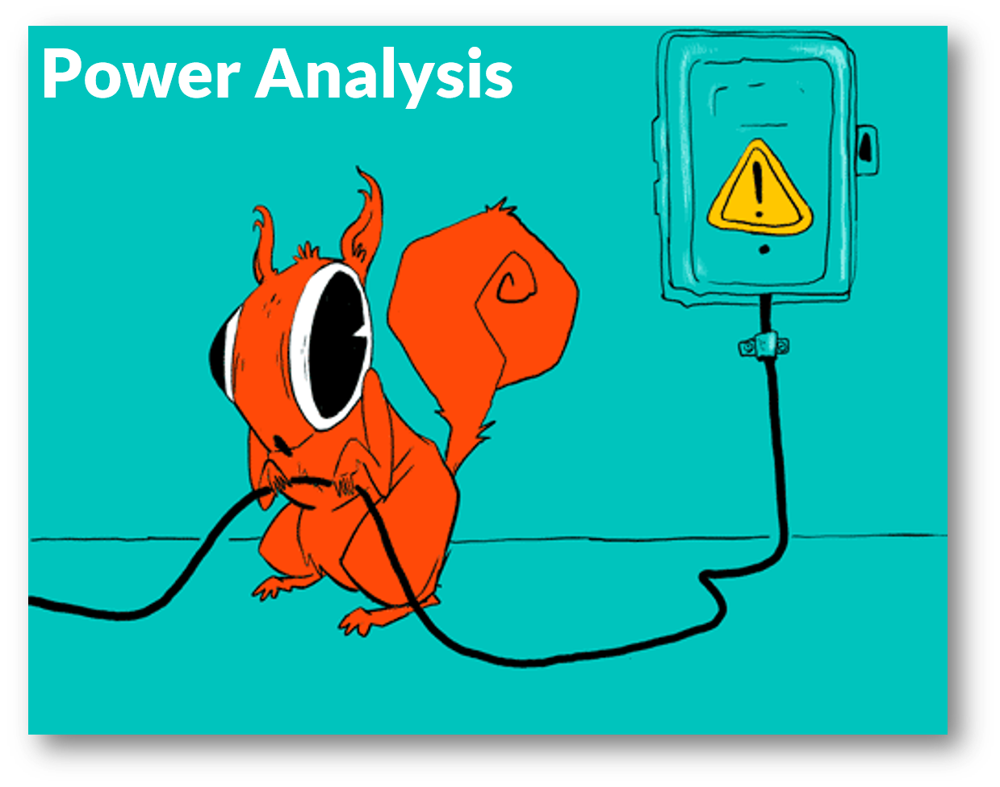

```{r setup, include=FALSE}
knitr::opts_chunk$set(echo = TRUE)
```

# Power Analysis App

This is an interactive **Shiny App** for exploring key statistical power concepts, including:

- Correlation and its impact on observed data
- Effect size visualizations
- Power estimation
- Sample size estimation
- Consequences of low-powered studies

The app is designed for researchers, students, and educators in psychology, social science, and related fields. 

## 🌐 Visit the App

You can view the app on my [my website](http://edgar-treischl.de/projects) or run via:

```{r, eval=FALSE}
library(shiny)
runGitHub("PowerApp", "edgar-treischl", ref="main")
```

<center>

</center>


