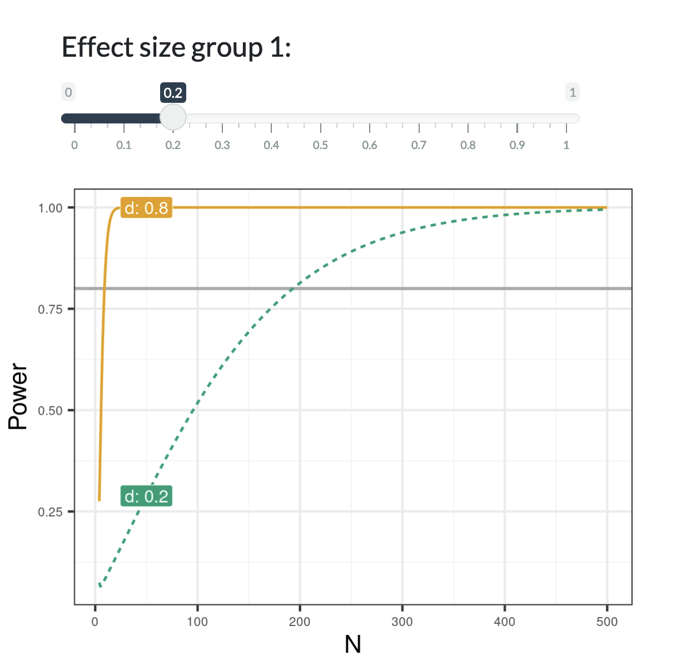

## Power-App

This is the repository for a R shiny app that introduces the basics of a power analysis. Students in class argue that a study has not enough statistical power, but their critique often relies on their gut and lacks an understanding how the sample size, effect size and statistical power work together. You can inspect the app on my [my personal website](http://edgar-treischl.de/projects) or run the app via:

```{r, eval=FALSE}
library(shiny)
runGitHub("Power-App", "edgar-treischl", ref="main")
```


<center>

</center>


For this reason I made the shiny app that shows students the basics of a power analysis. For instance, they can adjust different parameters such as the effect size and estimate the effect on power (as the preview shows); or calculate the number of observations given a certain effect size and sufficient statistical power.

<center>
    
</center>

